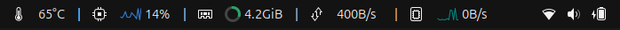
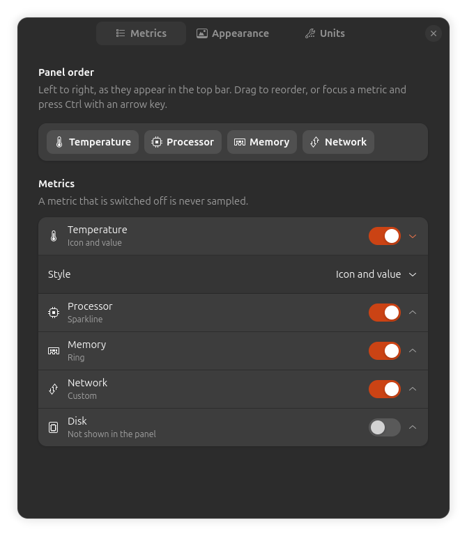

# System Monitor

A GNOME Shell extension showing CPU, memory, temperature, network and disk in the
top bar, beside the existing status icons.

Every metric can be switched off independently and each one picks its own look,
from a plain number to a live sparkline. Clicking the indicator opens a detail
view with per-core CPU, swap, and network and disk split by direction.



## Requirements

- GNOME Shell 48, 49 or 50
- Ubuntu GNOME. Fedora and others are likely fine, since everything is read from
  `/proc` and `/sys`, but they are untested.

No dependencies beyond GNOME itself. There is no daemon, no network access, and
no libgtop: the metrics come straight from the kernel's own interfaces.

## Installing

Not yet on extensions.gnome.org. To run it from source:

```bash
git clone https://github.com/JamieDF/system-monitor.git
cd system-monitor
ln -s "$PWD" ~/.local/share/gnome-shell/extensions/system-monitor@jamiedf.github.io
glib-compile-schemas schemas/
```

Then log out and back in, and enable it:

```bash
gnome-extensions enable system-monitor@jamiedf.github.io
```

The log out is needed because GNOME Shell only picks up a newly installed
extension when it starts. Once installed, enabling and disabling work
immediately.

### Uninstalling

```bash
gnome-extensions disable system-monitor@jamiedf.github.io
rm ~/.local/share/gnome-shell/extensions/system-monitor@jamiedf.github.io
```

That removes the symlink, not the clone. Settings live in dconf and can be
cleared separately:

```bash
dconf reset -f /org/gnome/shell/extensions/system-monitor/
```

## Metrics

| Metric | Source | Shown |
|---|---|---|
| Processor | `/proc/stat` | Total use, per core in the dropdown |
| Memory | `/proc/meminfo` | Used, plus swap in the dropdown |
| Temperature | `/sys/class/hwmon` | CPU package, with the sensor named in the dropdown |
| Network | `/proc/net/dev` | Combined rate, up and down in the dropdown |
| Disk | `/proc/diskstats` | Combined rate, read and write in the dropdown |

## Display styles

Each metric independently picks one of eight presets:

Icon and value, text only, short label, colour coded, dot, bar, ring, sparkline.

The panel above shows four of them at once: icon and value on temperature, a
sparkline on the processor, a ring on memory, and another sparkline on disk.

Anything the presets do not cover can be built in **Custom**, which exposes the
five underlying axes directly: icon, label, graph, value and colour. The presets
are just named points in that space, not separate implementations.

Out of the box the style is matched to the shape of the data: sparklines for
rates that have no ceiling, a ring for memory because it is a fraction of a known
total, and icon plus value for temperature because it is an absolute reading.

## Preferences

```bash
gnome-extensions prefs system-monitor@jamiedf.github.io
```

Or use the Settings item in the dropdown.



Panel order is set by dragging the metrics in the order strip, or by focusing one
and pressing `Ctrl` with an arrow key. Each metric expands to choose its style.

## Overhead

Measured in an isolated shell rather than assumed: the extension's CPU cost is
too small to separate from the shell's own idle usage, and memory stays flat.

It stays that way by design. One timer drives every metric rather than one each,
disabled metrics are never sampled at all, and per-core parsing only runs while
the dropdown is actually open.

## How it works

Two processes, two toolkits. The panel runs inside `gnome-shell` using St, and
the preferences window runs separately using GTK4 and libadwaita. They share
nothing but GSettings.

```
src/metrics/      reading and parsing. Imports gi://GLib and nothing else.
src/poller.js     one shared timer, fanning out to the active providers.
src/ui/           panel widgets, glyph drawing, the dropdown.
prefs.js          the preferences window, in its own process.
```

The interesting constraint is that `src/metrics/` never imports St or Clutter.
That keeps the parsing and rate logic runnable under plain `gjs` with no display
server, which is why it can be tested at all. extensions.gnome.org enforces the
same separation independently.

The Cairo drawing is similarly split: `src/ui/renderers/draw.js` holds pure
functions taking a context and plain numbers, so glyphs can be rendered to an
offscreen surface and checked pixel by pixel rather than only by eye.

Run the tests with:

```bash
gjs -m tests/run.js
```

203 tests, covering the parsers against captured `/proc` files, rate maths
across suspend and counter resets, the poller's timer lifecycle, and the glyph
drawing pixel by pixel. They need no display server and no npm.

## Contributing

See [CONTRIBUTING.md](CONTRIBUTING.md). It covers the development loop, and in
particular the reload trap that catches everyone: GNOME Shell caches extension
code for the life of a session, so panel changes need a logout while preferences
changes do not.

## Licence

GPL-2.0-or-later. See [LICENSE](LICENSE).
